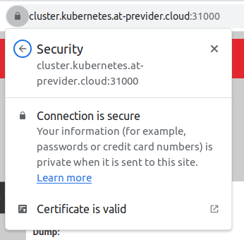

# 03 - SSL

In this manifest you will create and use:
- A [namespace](https://kubernetes.io/docs/concepts/overview/working-with-objects/namespaces/)
- A [Deployment](https://kubernetes.io/docs/concepts/workloads/controllers/deployment/)
- A [Service](https://kubernetes.io/docs/concepts/services-networking/service/)
- [Pods](https://kubernetes.io/docs/concepts/workloads/pods/)
- [Ingress Controller](https://kubernetes.io/docs/concepts/services-networking/ingress-controllers/)
- [Ingress](https://kubernetes.io/docs/concepts/services-networking/ingress/)
- [Cert-Manager](https://cert-manager.io/)
  - [Issuer](https://cert-manager.io/docs/concepts/issuer/)
  - [Certificate](https://cert-manager.io/docs/concepts/certificate/)


## Creating a namespace

Create the namespace named ``ssl``

### Manifest
```console
cat > 03_namespace.yaml << EOF
apiVersion: v1
kind: Namespace
metadata:
  labels:
    kubernetes.io/metadata.name: ssl
  name: ssl
EOF
```
```console
kubectl apply -f 03_namespace.yaml
```
### CLI
```console
kubectl create ns ssl
```

## Install the NGinx Ingress Controller
The following commandline will install the NGinx Ingress Controller into you cluster. These kind of resources are usually installed into a seperate namespace.  
This controller will be installed in its own ``ingress-nginx`` namespace.  
Installing the controller can be done via Helm or manifests. We will use the manifest of the Kubernetes repo, as this installs it using NodePort.

```shell
kubectl apply -f https://raw.githubusercontent.com/kubernetes/ingress-nginx/controller-v1.9.4/deploy/static/provider/baremetal/deploy.yaml
```

After running this command you shuold see output similar to this:
```text
namespace/ingress-nginx created
serviceaccount/ingress-nginx created
configmap/ingress-nginx-controller created
clusterrole.rbac.authorization.k8s.io/ingress-nginx created
clusterrolebinding.rbac.authorization.k8s.io/ingress-nginx created
role.rbac.authorization.k8s.io/ingress-nginx created
rolebinding.rbac.authorization.k8s.io/ingress-nginx created
service/ingress-nginx-controller-admission created
service/ingress-nginx-controller created
deployment.apps/ingress-nginx-controller created
ingressclass.networking.k8s.io/nginx created
validatingwebhookconfiguration.admissionregistration.k8s.io/ingress-nginx-admission created
serviceaccount/ingress-nginx-admission created
clusterrole.rbac.authorization.k8s.io/ingress-nginx-admission created
clusterrolebinding.rbac.authorization.k8s.io/ingress-nginx-admission created
role.rbac.authorization.k8s.io/ingress-nginx-admission created
rolebinding.rbac.authorization.k8s.io/ingress-nginx-admission created
job.batch/ingress-nginx-admission-create created
job.batch/ingress-nginx-admission-patch created
```

After installing the controller, wait until all pods have the "Running" state.  Check out your services also, there should be an ingress-nginx NodePort service available.
```shell
kubectl -n ingress-nginx get pods
kubectl -n ingress-nginx get svc
```
As you have maybe seen, Kubernetes randomly assigned a node port to the service. We want to change it to your assigned port.  
Using the following command, you will update your ingress-nginx service `https` port to port `32000`.
```shell
kubectl patch svc -n ingress-nginx ingress-nginx-controller --type='json' -p='[{"op": "replace", "path": "/spec/ports/1/nodePort", "value": 32000}]'
```
```text
#Before example:
NAME                                 TYPE        CLUSTER-IP      EXTERNAL-IP   PORT(S)                      AGE
ingress-nginx-controller             NodePort    10.109.57.22    <none>        80:32621/TCP,443:32173/TCP   20s

#After example
NAME                                 TYPE        CLUSTER-IP      EXTERNAL-IP   PORT(S)                      AGE
ingress-nginx-controller             NodePort    10.109.57.22    <none>        80:32621/TCP,443:32000/TCP   54s
```
As you see in the results, the before had port 32173 assigned dynamically. We changed it to 32000.

## Checkout your ingress controller
Open the url `https://cluster.kubernetes.at-previder.cloud:<yourport>` and replace the port with your dedicated port to check out the NGinx default page.  
When trying to access it, you will get an SSL error because the default Kubernetes Fake certificate is used to expose the service. We will fix that later.

## Deployment
We will deploy an instance of [KuaR](https://github.com/kubernetes-up-and-running/kuard) (Kubernetes up and Running) instance, which will be reachable on the hostname we will assign to it.  
First we deploy a Deployment and assigned service.
```shell
cat > 03_deployment_kuar.yaml << EOF
apiVersion: apps/v1
kind: Deployment
metadata:
  name: kuard-deployment
spec:
  selector:
    matchLabels:
      app.kubernetes.io/name: kuard-deployment
  replicas: 4
  template:
    metadata:
      labels:
        app.kubernetes.io/name: kuard-deployment
    spec:
      containers:
      - image: gcr.io/kuar-demo/kuard-amd64:1
        imagePullPolicy: Always
        name: kuard
        ports:
        - containerPort: 8080
---
apiVersion: v1
kind: Service
metadata:
  name: kuard-service
spec:
  ports:
  - port: 80
    targetPort: 8080
    protocol: TCP
  selector:
    app.kubernetes.io/name: kuard-deployment
EOF
```
```shell
kubectl -n ssl apply -f 03_deployment_kuar.yaml
```

This should have 4 pods of the application KuaR running in your cluster, check it out.
```shell
kubectl -n ssl get pods
```

## Ingress route
The pods and service are exposed inside the Kubernetes cluster, using an Ingress Route we can use the Ingress Controller to link a hostname or path to a service.
Replace both instances of `<yourusername>` with your username to make it unique to your cluster and a valid manifest.

```shell
cat > 03_ingress.yaml << EOF
apiVersion: networking.k8s.io/v1
kind: Ingress
metadata:
  name: kuard-ingress
  annotations:
    cert-manager.io/issuer: "letsencrypt-production"
spec:
  ingressClassName: nginx
  tls:
  - hosts:
    - <yourusername>.kubernetes.at-previder.cloud
    secretName: kuard-ingress-tls
  rules:
  - host: <yourusername>.kubernetes.at-previder.cloud
    http:
      paths:
      - path: /
        pathType: Prefix
        backend:
          service:
            name: kuard-service
            port:
              number: 80
EOF
```
```shell
kubectl -n ssl apply -f 03_ingress.yaml
```
After applying this manifest, you should see an ingress route and be able to check out the result
```shell
kubectl -n ssl get ingress
```

## Checkout your ingress KuaR instances
Open the url `https://<yourusername>.kubernetes.at-previder.cloud:<yourport>` and replace the port with your dedicated port to check out your KuaR instances, refresh to see the default Kubernetes loadbalancer in action.  
To see that the ingress is only forwarding your requested hostname, you can go to another subdomain like `https://notmyusername.kubernetes.at-previder.cloud:<yourport>` and you will see a 404 error.  
You will still get a certificate invalid error. We will set up LetsEncrypt next.


## Install Cert Manager and the PDNS webhook 
Secure SSL is a must nowadays, so we will set up our cluster to use LetsEncrypt to get a valid certificate for our domain.  
We will acquire one using Cert Manager and an add-on to use DNS verification of the domain.  
The following command will install Cert Manager into our cluster. After the installation we have some new resources available like Certificate and Issuer.
```shell
helm repo add jetstack https://charts.jetstack.io

helm install cert-manager jetstack/cert-manager \
  --namespace cert-manager \
  --create-namespace \
  --version v1.13.2 \
  --set installCRDs=true \
  --set extraArgs='{--dns01-recursive-nameservers-only,--dns01-self-check-nameservers=80.65.96.50:53\,8.8.8.8:53}'
```
Cert Manager already has ACME (LetsEncrypt) capabilities, but LetsEncrypt only allows validations over port 80, which is unavailable to us.  
The [Previder Portal DNS API](https://portal.previder.nl/api-docs.html#/Domain%20DNS%20API) acts as a proxy to our PowerDNS servers and using any PowerDNS client, we can update the DNS for validation of the records.

---
We will use the Cert Manager Webhook PDNS. Install it using the following helm commands.  
**Wait until all the Cert Manager pods are running before installing the webhook for PDNS.**
```shell
kubectl -n cert-manager get pods 
```
```shell
helm repo add cert-manager-webhook-pdns https://zachomedia.github.io/cert-manager-webhook-pdns
helm install --namespace cert-manager cert-manager-webhook-pdns cert-manager-webhook-pdns/cert-manager-webhook-pdns
```
The output should similar to the following
```shell
NAME: cert-manager-webhook-pdns
LAST DEPLOYED: <date>
NAMESPACE: cert-manager
STATUS: deployed
REVISION: 1
TEST SUITE: None
```
### Error after install
If you get an error like below
```text
Error: INSTALLATION FAILED: 2 errors occurred:
	* Internal error occurred: failed calling webhook "webhook.cert-manager.io": failed to call webhook: Post "https://cert-manager-webhook.cert-manager.svc:443/mutate?timeout=10s": dial tcp 10.96.227.129:443: connect: connection refused
```
You were too quick after installing cert-manager. No problem, just uninstall the webhook and try again.
```shell
helm uninstall --namespace cert-manager cert-manager-webhook-pdns cert-manager-webhook-pdns/cert-manager-webhook-pdns
helm install --namespace cert-manager cert-manager-webhook-pdns cert-manager-webhook-pdns/cert-manager-webhook-pdns
```

## Create token for DNS
To use the PDNS webhook we will need a token to authenticate from this addon to the Previder Portal.
Go to your [User Settings](https://portal.previder.nl/#/user/current/properties) in the top-right menu and choose the tab "Tokens".  
Create a new token and copy the secret.

Kubernetes uses Base64 based strings in their secrets, so we will need to convert the token to be able to use it.  
Paste your token into the manifest below before applying it to the server.  
```shell
cat > 03_token_secret.yaml << EOF
apiVersion: v1
kind: Secret
metadata:
  name: previder-portal-api-key
type: Opaque
data:
  key: `echo -n "<your-token>" | base64 | tr -d '\n'`
EOF
```
```shell
# Example
cat > 03_token_secret.yaml << EOF
apiVersion: v1
kind: Secret
metadata:
  name: previder-portal-api-key
type: Opaque
data:
  key: `echo -n "42aeb9f3d44c8f4dd29f48d2b56a6ac4c4151532655271b7fbd801571c8c45af" | base64 | tr -d '\n'`
EOF
```
Apply the manifest using the following command.
```shell
kubectl -n ssl apply -f 03_token_secret.yaml
```

To check out the created secret, execute the following command.
```shell
kubectl -n ssl get secret previder-portal-api-key -o yaml
```
To check if the token is correctly inserted, execute the following chain command.
```shell
kubectl -n ssl get secret previder-portal-api-key -o json | jq -r .data.key | base64 -d
```

## Create an issuer
Using an Issuer we can make sure we use LetsEncrypt to give us a valid certificate.  
This issuer is set up use the `dns01` [solver](https://letsencrypt.org/docs/challenge-types/#dns-01-challenge). This will use the PDNS webhook as we installed before using the token we configured in the secret.
Change the `<youruser>` variable to make it a valid email address.
```shell
cat > 03_issuer.yaml << EOF
apiVersion: cert-manager.io/v1
kind: Issuer
metadata:
  name: letsencrypt-production
spec:
  acme:
    email: <youruser>@previder.nl
    server: https://acme-v02.api.letsencrypt.org/directory
    privateKeySecretRef:
      name: letsencrypt-production-account-key
    solvers:
      - dns01:
          webhook:
            groupName: acme.zacharyseguin.ca
            solverName: pdns
            config:
              host: https://portal.previder.nl
              apiKeySecretRef:
                name: previder-portal-api-key
                key: key
              apiKeyHeaderName: "X-Auth-Token"
              serverID: "previder"
              ttl: 300
              timeout: 30
EOF
```
```shell
kubectl -n ssl apply -f 03_issuer.yaml
```
After creating this issuer, it should automatically start to request and validate the certificate at LetsEncrypt. To see if it is working, check out your certificate and logs of the cert-manager and cert-manager-webhook-pdns pods.
```shell
kubectl -n ssl get certificate
```
When the certificate get the `Ready` state to `True`, it has been applied and used in the Ingress Controller.  
If your certificate does not get the Ready state, use the describe command to see more details.  
The verification process can take a few minutes, when the command above shows `Ready True`, you can continue and the certificate has been applied to the Ingress Route.

```shell
kubectl -n ssl describe certificate kuard-ingress-tls
```

## Checkout your secured ingress KuaR instances
Open the url in a private window `Ctrl+Shift+N` `https://<yourusername>.kubernetes.at-previder.cloud:<yourport>` and replace the port with your dedicated port to check out your KuaR instances with a valid certificate.



## Cleanup
We need to clean up some resources like the Ingress Controller and Cert-Manager. If you want to play with it more in the next modules, they will not be blocking and can remain in your cluster.  
Removing the ingress-nginx and cert-manager may take a while. Do not interrupt this command.  
Ingress NGinx will keep running on port 32000, change this if you want to continue to the next module and keep the ingress controller for now.

```shell
# Remove Module specific manifests
kubectl delete ns ssl
# Remove Ingress Controller
kubectl delete ns ingress-nginx
# Remove Cert Manager
kubectl delete ns cert-manager
```
