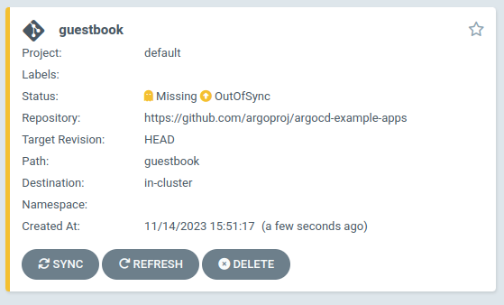
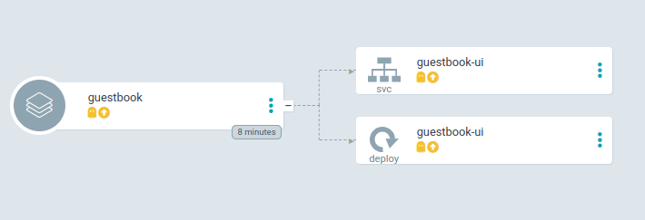
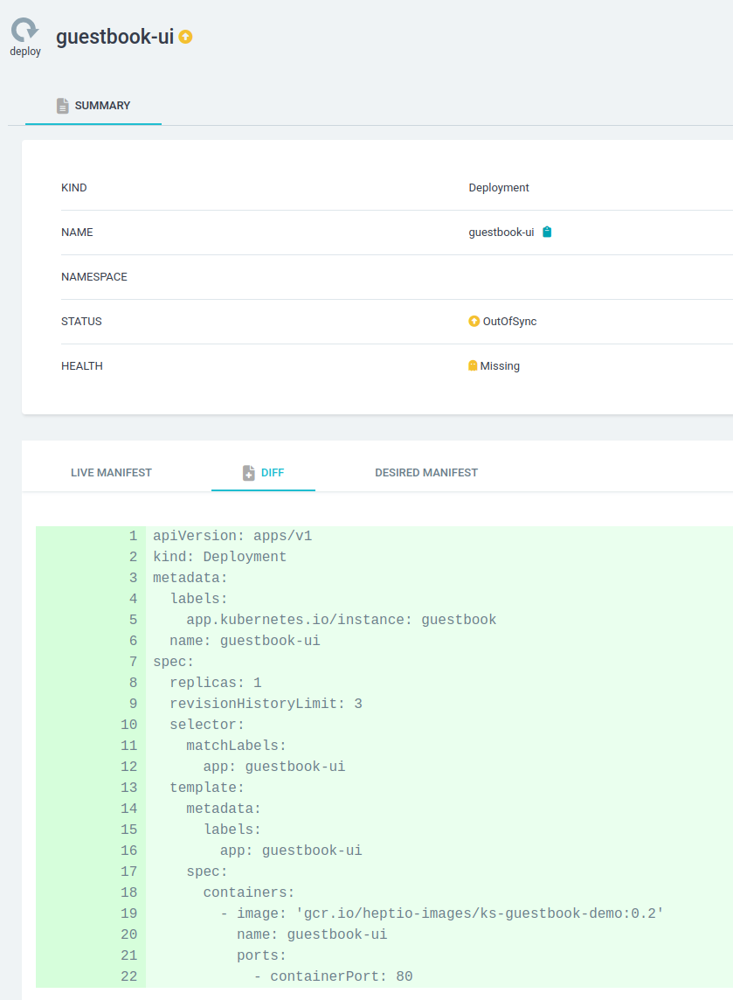

# 04 - ArgoCD

In this manifest you will create and use:
- A [namespace](https://kubernetes.io/docs/concepts/overview/working-with-objects/namespaces/)
- A [Service](https://kubernetes.io/docs/concepts/services-networking/service/)
- [ConfigMap](https://kubernetes.io/docs/concepts/configuration/configmap/)
- [Secret](https://kubernetes.io/docs/concepts/configuration/secret/)
- [ArgoCD](https://argo-cd.readthedocs.io/en/stable/)
  - [Application](https://argo-cd.readthedocs.io/en/stable/core_concepts/)

An easy way to see and manage Kubernetes resources using a GitOps way is to use a Continuous delivery tool like ArgoCD or Flux.  
In this module we will set up an ArgoCD instance, deploy applications and check the resources in the cluster itself.  
We will use deployments from ArgoCD project examples which use plain-text YAML files, Kustomize and Helm.

## Creating a namespace

Create the namespace named ``argocd``

### Manifest
```console
cat > 04_namespace.yaml << EOF
apiVersion: v1
kind: Namespace
metadata:
  labels:
    kubernetes.io/metadata.name: argocd
  name: argocd
EOF
```
```console
kubectl apply -f 04_namespace.yaml
```
### CLI
```console
kubectl create ns argocd
```

## Apply the ArgoCD manifest
Using the default installer we will apply all the manifests for a non-HA ArgoCD. They also supply default manifests for applying a HA instance out-of-the-box.
```shell
kubectl apply -n argocd -f https://raw.githubusercontent.com/argoproj/argo-cd/stable/manifests/install.yaml
```

Check the status of all pods, deployments and services using the following commands
```shell
kubectl -n argocd get deployments
kubectl -n argocd get pods
kubectl -n argocd get svc
```
As you can see in the last command, ArgoCD defaults to ClusterIP services. We will add a NodePort service to expose the service

```shell
cat > 04_argocd_service.yaml << EOF
apiVersion: v1
kind: Service
metadata:
  name: argocd-server-service
  labels:
    app.kubernetes.io/name: argocd-server-service
spec:
  ports:
    - port: 8080
      nodePort: 32000
  selector:
    app.kubernetes.io/name: argocd-server
  type: NodePort
EOF
```
```shell
kubectl -n argocd apply -f 04_argocd_service.yaml
```
This will create a NodePort exposing your ArgoCD on your url `https://cluster.kubernetes.at-previder.cloud:<yourport>`.  
By navigating you will get an SSL warning because ArgoCD by default uses a self-signed certificate.  
**If you got here from [Module 03 SSL](03_ssl.md) it is possible your browser has cached HSTS and you will not be able to continue. Use a private session `Ctrl+Shift+N` to continue for now.**


## Getting the admin password
ArgoCD server starts with a random default password which is saved in a Kubernetes Secret called `argocd-initial-admin-secret`.  
Using the following command we can extract the plain-text password.
```shell
kubectl -n argocd get secret argocd-initial-admin-secret -o json | jq -r .data.password | base64 -d
```
Login to ArgoCD with user `admin` and the just extracted password.  
After the login you will see an empty Applications screen. Using the `User Info` you can change the default password for admin if you want.  
In production environments you might not want local accounts, Keyhub can be linked to the system using an OIDC application in Keyhub. (Configs for this are available if wanted)

## Deploy your first application
ArgoCD is developed to take manifests from external sources like Git repositories or Helm repositories. This way all manifests are versioned and can be automatically applied using ArgoCD.  

On the Applications screen, click the `NEW APP` button to start creating a new Application. We will use some ArgoCD example projects.
There are many options which may seem intimidating, but they will all make sense when you use ArgoCD more.  
Options like the `Sync policy` are team and project independent, some projects and teams allow for auto sync after a commit, some want more control and will manually synchronize the application after a code change.

For now, enter the following fields:
- General
  - Application Name: `guestbook`
  - Project Name: `default`
  - Auto-create namespace: `Checked`
- Source
  - Repository URL: `https://github.com/argoproj/argocd-example-apps`
  - Path: `guestbook`
- Destination
  - Cluster URL: `https://kubernetes.default.svc` (Internal cluster where ArgoCD is installed)
  - Namespace: `guestbook`

That's it. Click the `Create` button at the top and the application will appear in the Application screen.

---
[](images/argocd_application_missing.png)

The application did nothing yet. We will first go into the application by clicking it you will see all the resources that will be applied when we synchronize the application.  

[](images/argocd_application_manifests_missing.png)  
By clicking the resource itself you can also check diff's between the current Kubernetes state and the new state from GIT.

[](images/argocd_application_diff.png)

## Synchronization
Go back into the application screen of `guestbook` and click the `SYNC` button. In the menu that just appeared, click the `SYNCHRONIZE` button.
Immediately after initiating a synchronization the manifests are applied to Kubernetes and soon the resources and application will show as `Healthy` and `Synced`.  
The resources are now applied and running on the cluster.

## Resources in the cluster
By executing the following command you can see the resources that have just been applied.
```shell
kubectl -n guestbook get all
```
This will show an output similar to below
```text
NAME                                READY   STATUS    RESTARTS   AGE
pod/guestbook-ui-56c646849b-5x7lb   1/1     Running   0          2m41s

NAME                   TYPE        CLUSTER-IP      EXTERNAL-IP   PORT(S)   AGE
service/guestbook-ui   ClusterIP   10.106.231.65   <none>        80/TCP    2m42s

NAME                           READY   UP-TO-DATE   AVAILABLE   AGE
deployment.apps/guestbook-ui   1/1     1            1           2m42s

NAME                                      DESIRED   CURRENT   READY   AGE
replicaset.apps/guestbook-ui-56c646849b   1         1         1       2m42s
```
As you can see, ArgoCD applied the resources to the cluster and they are running. To show the direct connection between ArgoCD and the cluster, we will now restart the Deployment and ArgoCD will show the progress.  
Split your screen with both a terminal and ArgoCD visible. Execute the command below.
```shell
kubectl -n guestbook rollout restart deployment/guestbook-ui
```
You see a new ReplicaSet being created with a new Pod and the old one is removed and cleaned up.

## Auto sync
In ArgoCD we will click the `APP DETAILS` button and click `Edit` in the top right.  
Under `SYNC POLICY` we will now Enable Auto-sync. Confirm and also enable `Self-heal`.  
Go back to the application screen.  
ArgoCD will now watch resources and with possible changes from Git or Helm automatically apply the resources missing or altered if possible.  
We will now delete the deployment directly from Kubernetes using the command below and see ArgoCD fix it automatically.  

```shell
kubectl -n guestbook delete deployment guestbook-ui
```

## Cleanup
This guestbook application is done, we do not need the app anymore. We could click in ArgoCD to remove it, or remove it using CLI.

```shell
kubectl -n argocd delete application guestbook
```

## YAML / Helm / Kustomize / Jsonnet
A lot of developers and Operators search for the *perfect* deployment format. Is it Plain-text YAML, using charts with Helm, overlays with Kustomize or configuration language Jsonnet.  
We have found out, there is no 1 solution. Every project has different dependencies and requirements. 

- **YAML**
  - Easy
  - Fast
  - Good for applications run only once or twice in an organization
  - Not very maintainable
- **Helm**
  - More complex than plain-text, but way more variable
  - Templating, inclusions, variables and functions. Very flexible
  - Great when the same application or YAML set is deployment many times with just different variables
  - Needs a Helm repository setup and for updates you need to alter the chart version, unless automated a bit more hassle to deploy a new version
  - Has static variables which can be overridden per application in the values.yaml
- **Kustomize**
  - More complex than plain-text, more flexible
  - Easy to use for a few different environments of an application
  - No variables, only image versions are variable
  - Very easy to override parts of a default application using merging of resources
- **Jsonnet**
  - Powerful configuration language with variables, methods, conditionals
  - Steep learning curve
  - Used to create configuration data in JSON
  - Strong in very big projects with big data sets and lots of variables

ArgoCD supports all of these and combinations.

Using [this repository](https://github.com/argoproj/argocd-example-apps/) try to deploy the different applications.  
The Helm chart does not have a repository, for this try to deploy the NFS provisioner from [Module 02 STaaS](02_staas.md): `https://kubernetes-sigs.github.io/nfs-subdir-external-provisioner/`. 

## Cleanup of ArgoCD
When you have enough of ArgoCD simply execute the command below to remove the namespace including all resources.
```shell
kubectl delete ns argocd
```
