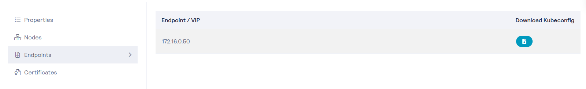

# helm install previder-cluster 
## Kubernetes Demo manifests
This repo contains different example manifests to use on a Kubernetes cluster to get used to kubectl and helm.  
Starting with deploying a simple app on the prepared systems which will become reachable on your VIP and dedicated port.

All modules can be completed without finishing the previous, but it is advised to clean up after each module as described on each page.

The modules are not a competition, read well what it does before applying a manifest so possible variables are replaced before applying.

## Prerequisites
All module expect your cluster config setup on the ubuntu server. Kubectl, Helm and JQ have already been installed and prepared.

---
Execute the following command in your home directory of the server to create the base folder.
```console
mkdir ~/.kube
```
---
Download your kubeconfig from the [Previder Portal](https://portal.previder.nl/#/kubernetes/cluster) by going into the details of your cluster in the list view and click on the Endpoints tab.



Open the downloaded file using your favorite notepad and add the following line at the top
```console
cat > ~/.kube/config << EOF
```
End add this as the last line
```console
EOF
```

It should look like this, but the contents will differ:
```console
cat > ~/.kube/config << EOF
---
apiVersion: v1
clusters:
- cluster:
    server: https://<ip address>:6443
    certificate-authority-data: LS0tLS1CRUdJTiBDRVJUSUZJQ0FURS...
  name: 000005
contexts:
- context:
    cluster: clustername
    user: admin-name
  name: admin-name@clustername
kind: Config
preferences: {}
users:
- name: adminname
  user:
    client-certificate-data: LS0tLS1CRUdJTiBDRVJUSUZJQ0FURS0tL...
    client-key-data: LS0tLS1CRUdJTiBSU0EgUFJJVkFURSBLRVktLS0tLQpNSU...
current-context: admin-name@clustername
EOF
```

Copy and paste the contents of the entire file including the commands we added and paste it into the server.  
This will create the config file, check the creation of this file by executing the next command, it should output the contents of the file.
```console
cat ~/.kube/config
```
 
To secure your kubeconfig from others, execute the command:
```console
chmod 400 ~/.kube/config
```

# NAT and Firewalling
In the test setup, you will receive your own VIP and assigned NAT port. All ports are NATted to port **32000** on your cluster.  
Only when connecting to your cluster using your browser, you will need your assigned port.

# Templates
Some of the manifests contain a variable like `<yourusername>`,`<yourvip>` or `<yourport>`. Replace these before applying the manifest.
These manifests are easiest to copy them into a Notepad application first, replace the variables and then copy them into your terminal.  
**Do not use Word, or other "bigger" applications, they tend to mess up spaces, tabs and end-of-lines. Use Wordpad, Notepad, [Notepad++](https://notepad-plus-plus.org/downloads/v8.5.8/)**

## Kubernetes resources
Many of the resources used today are default Kubernetes Resources which are documented on the [Kubernetes docs](https://kubernetes.io/docs/concepts/)

# Modules
- [01 - Deployment](01_deployment.md)
- [02 - STaaS](02_staas.md)
- [03 - SSL](03_ssl.md)
- [04 - ArgoCD](04_argocd.md)
